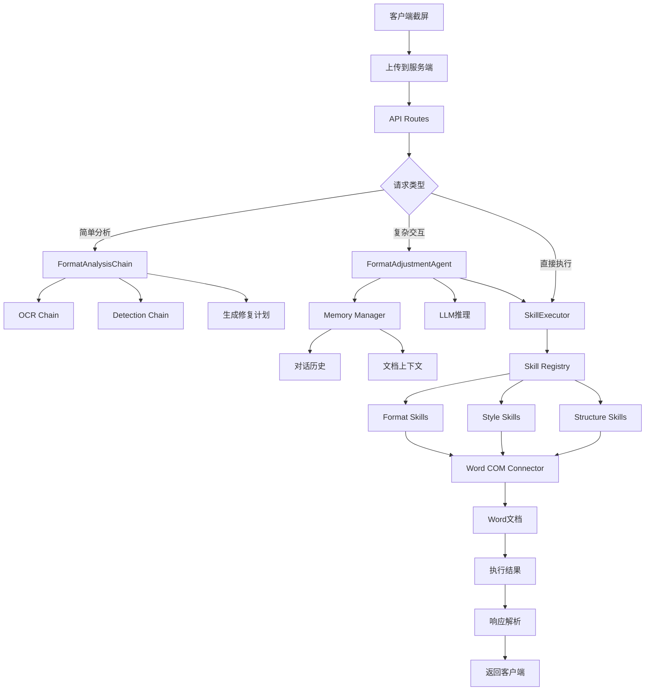

# 智能文档格式调整助手 - LangChain服务端模块规划

## 一、技术架构重构

### 1.1 LangChain核心集成
```
┌─────────────────────────────────────────────────────────────────┐
│                    LangChain服务端架构                           │
├─────────────────────────────────────────────────────────────────┤
│                                                                 │
│  ┌─────────────────────────────────────────────────────────┐   │
│  │                    LangChain Core                       │   │
│  │  ┌──────────┐ ┌──────────┐ ┌──────────┐ ┌──────────┐   │   │
│  │  │  Chains  │ │  Agents  │ │  Memory  │ │ Prompts │   │   │
│  │  └────┬─────┘ └────┬─────┘ └────┬─────┘ └────┬─────┘   │   │
│  └───────┼────────────┼────────────┼────────────┼─────────┘   │
│          │            │            │            │             │
│          ▼            ▼            ▼            ▼             │
│  ┌─────────────────────────────────────────────────────────┐   │
│  │                  Application Layer                       │   │
│  │     (FormatAdjustmentAgent + SkillExecutor)              │   │
│  └─────────────────────────────────────────────────────────┘   │
│                           │                                     │
│  ┌─────────────────────────────────────────────────────────┐   │
│  │               LLM Providers (LangChain)                 │   │
│  │    OpenAI │ Anthropic │ Ollama │ HuggingFace            │   │
│  └─────────────────────────────────────────────────────────┘   │
│                                                                 │
└─────────────────────────────────────────────────────────────────┘
```

### 1.2 核心组件映射
| LangChain组件 | 在本项目中的应用 |
|--------------|-----------------|
| **LLM Wrapper** | 封装OpenAI/Claude/本地模型的统一接口 |
| **Chains** | 构建格式分析链、修复执行链 |
| **Agents** | 文档格式调整智能体(FormatAdjustmentAgent) |
| **Tools** | Skills库作为LangChain Tools调用 |
| **Memory** | 对话历史、文档上下文记忆 |
| **Prompt Templates** | 格式调整相关的提示词模板 |

---

## 二、服务端模块结构

```
server/
├── api/                              # API层
│   ├── routes/
│   │   ├── analyze_routes.py         # 分析接口 (Chain调用)
│   │   ├── agent_routes.py           # 智能体接口 (Agent调用)
│   │   └── skill_routes.py           # Skill工具接口
│   └── middleware/
│       ├── auth.py                   # 认证中间件
│       └── rate_limit.py             # 限流中间件
│
├── langchain/                        # LangChain核心模块
│   ├── agents/                       # 智能体
│   │   ├── base_agent.py            # Agent抽象基类
│   │   ├── format_agent.py           # 文档格式调整Agent
│   │   └── multi_step_agent.py       # 多步骤执行Agent
│   ├── chains/                       # 链式调用
│   │   ├── base.py                   # Chain抽象基类
│   │   ├── analysis_chain.py         # 格式分析Chain
│   │   ├── repair_chain.py           # 格式修复Chain
│   │   └── summary_chain.py          # 结果总结Chain
│   ├── memory/                       # 记忆管理
│   │   ├── conversation_memory.py   # 对话记忆
│   │   ├── document_context.py       # 文档上下文记忆
│   │   └── memory_manager.py          # 记忆管理器
│   └── prompts/                      # 提示词模板
│       ├── analysis_prompts.py       # 分析提示词
│       ├── repair_prompts.py        # 修复提示词
│       └── system_prompts.py        # 系统提示词
│
├── llm/                              # LLM配置
│   ├── factory.py                   # LLM工厂类
│   ├── config.py                    # LLM配置模型
│   └── callbacks.py                  # 回调处理
│
├── skills/                           # Skills库 (LangChain Tools)
│   ├── base.py                       # Skill抽象基类 (Tool)
│   ├── format_skills.py              # 格式调整Skills
│   ├── style_skills.py               # 样式Skills
│   ├── structure_skkills.py          # 结构Skills
│   └── skill_registry.py            # Skills注册表
│
├── services/                         # 业务服务
│   ├── image_service.py             # 图片分析服务
│   ├── document_service.py          # 文档处理服务
│   └── response_parser.py           # 响应解析服务
│
├── models/                           # 数据模型
│   ├── requests.py                  # 请求模型
│   └── responses.py                 # 响应模型
│
└── config/
    ├── config.py                    # 服务配置
    └── settings.yaml               # YAML配置
```

---

## 三、LangChain核心模块详解

### 3.1 智能体模块 (Agents)

#### FormatAdjustmentAgent - 文档格式调整智能体
```python
# server/langchain/agents/format_agent.py

from langchain.agents import AgentExecutor, create_openai_functions_agent
from langchain.prompts import ChatPromptTemplate, MessagesPlaceholder
from langchain.tools import Tool

class FormatAdjustmentAgent:
    """基于LangChain的文档格式调整智能体"""
    
    def __init__(self, llm, skills: List[Tool], memory_manager):
        self.llm = llm
        self.skills = skills
        self.memory_manager = memory_manager
        
        # 构建提示词模板
        self.prompt = ChatPromptTemplate.from_messages([
            ("system", SYSTEM_PROMPT),
            MessagesPlaceholder(variable_name="chat_history", optional=True),
            ("human", "{input}"),
            MessagesPlaceholder(variable_name="agent_scratchpad"),
        ])
        
        # 创建Agent
        self.agent = create_openai_functions_agent(llm, self.skills, self.prompt)
        self.executor = AgentExecutor(
            agent=self.agent, 
            tools=self.skills,
            verbose=True,
            max_iterations=10,
            memory=self.memory_manager.get_conversation_memory()
        )
    
    async def analyze_and_repair(
        self, 
        screenshot: str,
        user_request: str,
        document_context: Dict = None
    ) -> AgentResult:
        """分析截图并执行格式调整"""
        pass
```

### 3.2 链模块 (Chains)

#### 格式分析Chain
```python
# server/langchain/chains/analysis_chain.py

from langchain.chains import LLMChain, SequentialChain
from langchain.prompts import PromptTemplate

class FormatAnalysisChain:
    """格式分析链 - 多阶段分析"""
    
    def __init__(self, llm):
        self.ocr_chain = self._build_ocr_chain(llm)
        self.detection_chain = self._build_detection_chain(llm)
        self.prioritization_chain = self._build_prioritization_chain(llm)
        
        # 组合成顺序链
        self.full_chain = SequentialChain(
            chains=[
                self.ocr_chain,
                self.detection_chain,
                self.prioritization_chain
            ],
            input_variables=["screenshot", "document_type"],
            output_variables=["issues", "priority", "action_plan"]
        )
    
    def _build_ocr_chain(self, llm):
        """OCR识别链"""
        template = """分析这张文档截图，识别所有可见文本内容：
{screenshot}

请提取：
1. 标题文本
2. 各级段落内容
3. 特殊元素（表格、图表、页码等）
"""
        return LLMChain(llm=llm, prompt=PromptTemplate.from_template(template))
    
    def _build_detection_chain(self, llm):
        """格式问题检测链"""
        template = """根据OCR结果，分析文档格式问题：
{text_result}

请检查以下方面并列出问题：
1. 字体问题（字体家族、大小、颜色）
2. 段落格式（对齐、行距、缩进、间距）
3. 页面布局（边距、纸张方向）
4. 样式应用（标题样式、目录）
5. 其他格式问题
"""
        return LLMChain(llm=llm, prompt=PromptTemplate.from_template(template))
```

#### 修复执行Chain
```python
# server/langchain/chains/repair_chain.py

class FormatRepairChain:
    """格式修复链 - 生成并执行修复计划"""
    
    def __init__(self, llm, skill_executor):
        self.llm = llm
        self.skill_executor = skill_executor
        
        self.plan_chain = self._build_planning_chain(llm)
        self.execute_chain = self._build_execution_chain(llm)
        self.verify_chain = self._build_verification_chain(llm)
    
    async def run(
        self,
        issues: List[str],
        user_request: str,
        document_path: str = None
    ) -> RepairResult:
        """执行完整的修复流程"""
        # 阶段1: 生成修复计划
        plan = await self.plan_chain.arun(
            issues=issues,
            request=user_request
        )
        
        # 阶段2: 执行修复步骤
        results = await self.execute_chain.arun(
            plan=plan,
            document_path=document_path
        )
        
        # 阶段3: 验证修复结果
        verification = await self.verify_chain.arun(
            original_issues=issues,
            results=results
        )
        
        return RepairResult(plan, results, verification)
```

### 3.3 记忆模块 (Memory)

```python
# server/langchain/memory/memory_manager.py

from langchain.memory import ConversationBufferMemory, VectorStoreRetrieverMemory
from langchain.vectorstores import FAISS
from langchain.embeddings import OpenAIEmbeddings

class MemoryManager:
    """LangChain记忆管理器"""
    
    def __init__(self, persist_path: str = "./data/memory"):
        self.conversation_memory = ConversationBufferMemory(
            return_messages=True,
            memory_key="chat_history"
        )
        
        # 文档上下文记忆（基于向量存储）
        self.document_memory = VectorStoreRetrieverMemory(
            vectorstore=FAISS(
                embedding_function=OpenAIEmbeddings(),
                persist_path=f"{persist_path}/document_store"
            ),
            memory_key="document_context"
        )
    
    def get_conversation_memory(self) -> ConversationBufferMemory:
        """获取对话记忆"""
        return self.conversation_memory
    
    def save_document_context(self, doc_id: str, context: Dict):
        """保存文档上下文"""
        self.document_memory.save_context(
            {"input": f"Document {doc_id}"},
            {"output": str(context)}
        )
    
    def get_relevant_context(self, query: str) -> List[str]:
        """获取相关上下文"""
        return self.document_memory.load_relevant_memory(query)
```

### 3.4 Skills作为LangChain Tools

```python
# server/skills/base.py

from langchain.tools import BaseTool
from pydantic import BaseModel, Field

class FormatSkill(BaseTool):
    """格式调整Skill基类 - 继承LangChain BaseTool"""
    
    name: str
    description: str
    parameters: dict
    
    def _run(self, **kwargs) -> SkillResult:
        """同步执行"""
        return self.execute(**kwargs)
    
    async def _arun(self, **kwargs) -> SkillResult:
        """异步执行"""
        return await self.execute_async(**kwargs)
    
    @abstractmethod
    def execute(self, **kwargs) -> SkillResult:
        """具体实现"""
        pass
```

#### 示例Skill实现
```python
# server/skills/format_skills.py

class SetFontSkill(FormatSkill):
    """设置字体Skill"""
    
    name = "set_font"
    description = """设置文档中指定文本的字体属性。
使用此Skill来修改字体家族、大小、颜色、是否加粗斜体等。
输入参数：font_name, size, bold, italic, color, target_element"""
    
    parameters = {
        "type": "object",
        "properties": {
            "font_name": {"type": "string", "description": "字体名称，如：微软雅黑、宋体"},
            "size": {"type": "integer", "description": "字号，如：12, 16, 24"},
            "bold": {"type": "boolean", "description": "是否加粗"},
            "italic": {"type": "boolean", "description": "是否斜体"},
            "color": {"type": "string", "description": "字体颜色，RGB格式如 #FF0000"},
            "target": {"type": "string", "description": "目标元素：title/paragraph/all"}
        },
        "required": ["font_name"]
    }
    
    def __init__(self, word_connector):
        super().__init__(name=self.name, description=self.description)
        self.word_connector = word_connector
    
    def execute(self, **kwargs) -> SkillResult:
        try:
            result = self.word_connector.set_font(**kwargs)
            return SkillResult(success=True, message=f"字体已设置为{kwargs}")
        except Exception as e:
            return SkillResult(success=False, error=str(e))
```

---

## 四、提示词模板 (Prompts)

### 4.1 系统提示词
```python
# server/langchain/prompts/system_prompts.py

SYSTEM_PROMPT = """你是一个专业的文档格式调整助手。你的任务是帮助用户分析和修复Word文档的格式问题。

## 你的能力
1. 分析文档截屏，识别格式问题
2. 理解用户的格式调整需求
3. 调用适当的工具(Skills)来执行修复
4. 验证修复结果，确保符合用户要求

## 工作流程
1. 首先分析截屏中的文档内容和格式
2. 识别具体的格式问题（字体、段落、布局等）
3. 制定修复计划并执行
4. 向用户报告结果

## 注意事项
- 只使用提供的工具，不要编造不存在的功能
- 对于不确定的操作，先询问用户
- 保持对话简洁，明确说明已完成的工作
- 如果工具调用失败，提供清晰的错误说明

## 可用工具
{tools}
"""

FORMAT_ANALYSIS_PROMPT = """分析这张文档截图，识别格式问题：

{screenshot}

文档类型：{document_type}
用户需求：{user_request}

请按以下格式回复：
## 格式问题检测
1. [问题1]
2. [问题2]
...

## 建议修复方案
1. [操作1]：使用[工具名称]，参数：{...}
2. [操作2]：使用[工具名称]，参数：{...}
...
"""
```

---

## 五、API路由设计

### 5.1 分析接口
```python
# server/api/routes/analyze_routes.py

from fastapi import APIRouter, UploadFile, File, HTTPException
from langchain.schema import HumanMessage

router = APIRouter(prefix="/api/v1", tags=["analyze"])

@router.post("/analyze")
async def analyze_screenshot(
    file: UploadFile = File(...),
    user_request: str = "",
    model: str = "openai"
):
    """分析截屏并返回格式问题和建议"""
    
    # 读取图片
    image_content = await file.read()
    base64_image = encode_image(image_content)
    
    # 获取LLM实例
    llm = LLMFactory.get_llm(model)
    
    # 构建分析链
    chain = FormatAnalysisChain(llm)
    
    # 执行分析
    result = chain.run(
        screenshot=base64_image,
        document_type="word",
        user_request=user_request
    )
    
    return result

@router.post("/analyze/stream")
async def analyze_screenshot_stream(
    file: UploadFile = File(...),
    user_request: str = ""
):
    """流式分析截屏"""
    # 实现流式响应
    pass
```

### 5.2 智能体接口
```python
# server/api/routes/agent_routes.py

from langchain.schema import HumanMessage, AIMessage

router = APIRouter(prefix="/api/v1/agent", tags=["agent"])

@router.post("/chat")
async def agent_chat(request: ChatRequest):
    """与格式调整智能体对话"""
    
    agent = FormatAdjustmentAgent(
        llm=LLMFactory.get_llm(request.model),
        skills=SkillRegistry.get_all_tools(),
        memory_manager=MemoryManager()
    )
    
    result = await agent.executor.arun(
        input=request.message,
        chat_history=request.history
    )
    
    return {"response": result["output"]}

@router.post("/execute")
async def execute_repair(request: ExecuteRequest):
    """执行格式修复"""
    
    agent = FormatAdjustmentAgent(
        llm=LLMFactory.get_llm(request.model),
        skills=SkillRegistry.get_tools_for_task(request.task_type),
        memory_manager=MemoryManager()
    )
    
    result = await agent.execute_plan(
        plan=request.plan,
        document_path=request.document_path
    )
    
    return result
```

---

## 六、数据流程图



---

## 七、依赖文件更新

### requirements_server.txt (含LangChain)
```txt
# Web框架
flask>=2.3.0
flask-cors>=4.0.0
gunicorn>=21.0.0

# LangChain核心
langchain>=0.1.0
langchain-openai>=0.0.5
langchain-anthropic>=0.1.0
langchain-community>=0.0.10

# 向量存储 (用于记忆)
faiss-cpu>=1.7.0
langchain-core>=0.1.0

# LLM提供商
openai>=1.0.0
anthropic>=0.3.0
ollama>=0.1.0

# 工具依赖
python-dotenv>=1.0.0
pydantic>=2.0.0
Pillow>=10.0.0
python-multipart>=0.0.6
PyYAML>=6.0.1
```

---

## 八、开发任务调整

### LangChain集成阶段 (新增)
| 任务ID | 任务名称 | 交付物 | 工期 |
|--------|---------|--------|------|
| T2.6 | LangChain核心配置 | LLM工厂、配置类 | 2天 |
| T2.7 | 提示词模板开发 | 系统/分析/修复提示词 | 2天 |
| T2.8 | Memory系统实现 | 对话记忆、向量记忆 | 2天 |
| T2.9 | FormatAdjustmentAgent | 智能体实现 | 3天 |
| T2.10 | FormatAnalysisChain | 分析链实现 | 2天 |
| T2.11 | FormatRepairChain | 修复链实现 | 2天 |
| T2.12 | Skills转Tools封装 | Skills注册为LangChain Tools | 2天 |

---

## 九、与原方案对比

| 维度 | 原方案 | LangChain方案 |
|-----|--------|--------------|
| **LLM调用** | 手动封装 | LangChain统一抽象 |
| **Agent架构** | 自定义实现 | LangChain Agents |
| **链式调用** | 自定义链 | LangChain Chains |
| **工具调用** | 自定义注册 | LangChain Tools |
| **记忆管理** | 简单缓存 | VectorStoreMemory |
| **提示词** | 硬编码字符串 | Prompt Templates |
| **扩展性** | 需重构 | 插拔式扩展 |

---

## 十、总结

采用LangChain框架后，服务端模块将具备：

1. **标准化**: 遵循LangChain设计模式，社区生态支持
2. **模块化**: Chains/Agents/Tools独立，可组合使用
3. **可扩展**: 轻松添加新LLM提供商、新Skills
4. **记忆持久化**: 支持对话历史和文档上下文的长期存储
5. **流式支持**: 原生支持LLM流式输出
6. **多模型切换**: 统一接口切换不同LLM提供商

总工期预计增加约2周用于LangChain集成和优化。